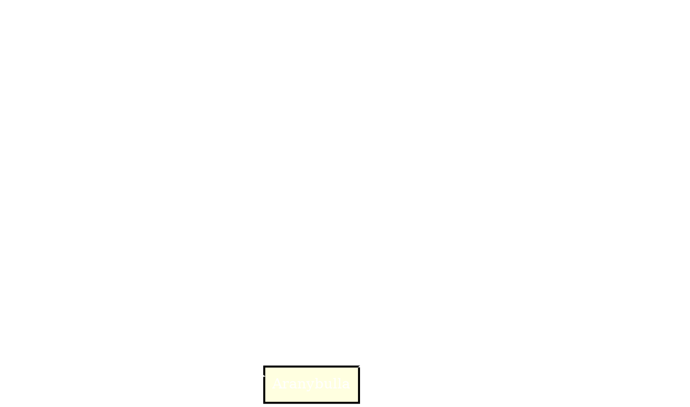

- Apja III. Béla
	- László szentté avatása
	- Korszerűsíti az állam igazgatását
	- Bevezeti a kancellária intézményét
- 1205 - 1235
- Domaniális jövedelmek → termény
	- Királyi jövedelmek nagy részét adó jövedelme
- Mértéktelen birtokadományozásokba kezdett
	- Célja a támogatók gyarapítása
	- Csökkennek a domaniális jövedelmek → üres a kincstár → Regálé jövedelmek (Királyi felségjogon szerzett jövedelem) aránya megnő
- Regálé jövedelmek → pénz
	- Vámok
	- Bányabér
	- Monopóliumok
		- Valaminek a kizárólagos termelésének, forgalmazásának joga
	- Pénzrontás eszköze
- Új berendezkedés
	- Birtokadományozás
	- Regálé jövedelmek
- Gertrúd
	- Melániából jött
	- András felesége
- Fontos tisztségeket adományoz idegeneknek
- Keresztes hadjárat indítása
- Háború Halics megszegéséért
	- Addig Bánk bán vezetésével megölik a királynét Pilisben
- “A királynét megölni nem kell félnetek jó lesz ha mindenki egyetért én nem ellenzem”

## Sikertelen külpolitika
- Eredménytelen hadjáratok Halicsba
- 1217 - kereszteshadjárat a Szentföldre
	- Drága és hiábavaló
- Nagybirtokosok haderejét vette igénybe újabb birtokadományokért

- Évenkénti pénzbeváltás (illeték) + pénzrontás![[6. Drawing 2026-02-18 08.54.04.excalidraw]]

- 13. században létrejön a jogilag egységes jobbágyság és nemesség
- A birtokadományozások hatására csökkent a királyi birtokállomány, hadjáratok alatt pedig háttérbe szorultak a királynak katonáskodó rétegek:
	- Várjobbágyok, szerviensek, bárók összefognak a király ellen
	- 1222 - Aranybulla
		- Függőpecséttel ellátott királyi oklevél
